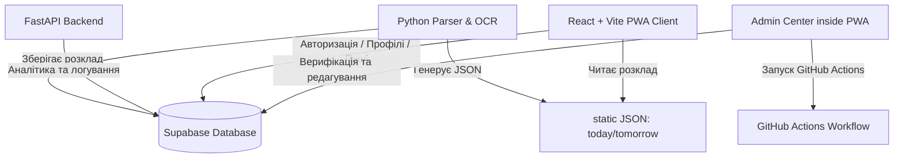

# ⚡ SvitloSk: Автоматизована система моніторингу графіків відключень

Сучасна багатокомпонентна платформа для збору, розпізнавання, ручної верифікації та інтерактивного відображення графіків погодинних відключень електроенергії (ГПВ).

Проект розроблений як прогресивний веб-додаток (PWA) з адаптивною неоновою темою, інтерактивною шкалою часу ("Машина часу") та розумною системою сповіщень.

---

## 🏗️ Архітектура системи

Система побудована за модульним принципом і складається з чотирьох ключових шарів:



1. **PWA Клієнт (React + TypeScript + Vite)**:
   * **Головний екран**: Швидкий перегляд поточного стану («Світло є» / «Світла немає»), зворотний відлік до наступної події та інтерактивна шкала часу.
   * **Графік на завтра**: Окремий тимчасовий плановий екран у неоново-фіолетовій гамі з повзунком, що автоматично повертається на `00:00`.
   * **Центр верифікації (Адмінка)**: Пульт управління даними (редагування сітки графіків, аудит дій, обробка запитів на додавання адрес, моніторинг пуш-сповіщень).
2. **Аналітичний мікросервіс (FastAPI + Python)**:
   * Обробка складної статистики, моніторинг навантаження розсилки та системна телеметрія.
3. **Модуль збору даних (Python Parser)**:
   * Автоматичний моніторинг сайтів обленерго, Telegram-каналів, розпізнавання графіків (OCR) та вивантаження результатів у Supabase та статичні JSON файли.
4. **Хмарна інфраструктура (Supabase)**:
   * Збереження профілів користувачів, черг сповіщень, логів аудиту дій адміністраторів та надійна автентифікація.

---

## 🛠️ Технологічний стек

* **Frontend**: React 18, TypeScript, Vite, Zustand (керування станом), Tailwind CSS / Vanilla CSS (стилізація), React Router.
* **Backend**: Python 3.10+, FastAPI, SQLite, Supabase-py.
* **Parser & Tools**: Python, Pillow/Pytesseract (OCR розпізнавання зображень), GitHub Actions (автоматичний парсинг за розкладом).
* **База даних**: Supabase (PostgreSQL), SQLite (локальний кеш парсера).
* **Деплой**: GitHub Pages (для PWA клієнта), Docker / Docker-compose (контейнеризація бекенду).

---

## 🚀 Функціональні можливості

* **Інтерактивна шкала («Машина часу»)**: Можливість перетягувати повзунок часу на сьогодні/завтра та бачити стан мережі в будь-яку хвилину доби.
* **Розумні PWA Пуш-сповіщення**: Отримання попереджень про відключення відповідно до обраної підчерги.
* **Автоматичний парсинг**: Збір даних без участі людини, формування `today.json` та `tomorrow.json`.
* **Верифікація даних (Human-in-the-loop)**: Шій або парсер пропонують сітку відключень — адміністратор підтверджує або коригує її вручну перед публікацією через вбудований графічний редактор.
* **Логування аудиту**: Запис усіх дій модераторів та адміністраторів для гарантування безпеки та прозорості змін.
* **Telegram PNG Експортер**: Генерація адаптованих під месенджери картинок-графіків одним кліком в адмінці.

---

## 📂 Структура репозиторію

* `/web` — Вихідний код PWA-клієнта (React + Vite).
* `/parser` — Скрипти збору даних та синхронізації з базою.
* `/backend` — FastAPI мікросервіс телеметрії та аналітики.
* `/supabase` — Конфігураційні SQL-файли та схеми таблиць.
* `DATA_README.md` — Детальний опис форматів та структур даних графіків відключень.

---

## 💻 Локальне розгортання

### 1. Клієнтська частина (PWA Web)
```bash
cd web
npm install --legacy-peer-deps
npm run dev
```
Додаток буде доступний за адресою `http://localhost:5173`.

### 2. Бекенд (FastAPI)
```bash
cd backend
pip install -r requirements.txt
uvicorn main:app --reload
```
Документація API буде доступна за адресою `http://localhost:8000/docs`.

### 3. Парсер (Parser)
```bash
cd parser
pip install -r requirements.txt
python sync_supabase.py
```

---

## 🛡️ Ліцензія

Проект розповсюджується під ліцензією MIT. Деталі див. у файлі LICENSE.
